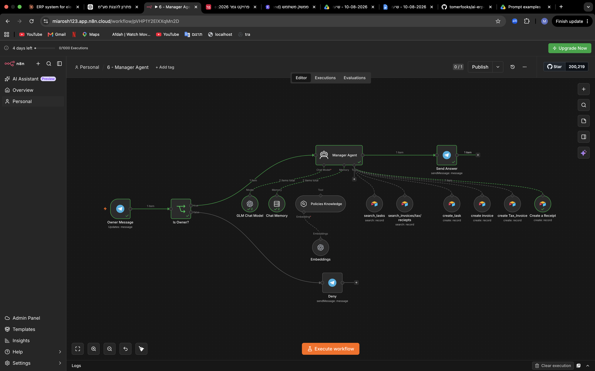
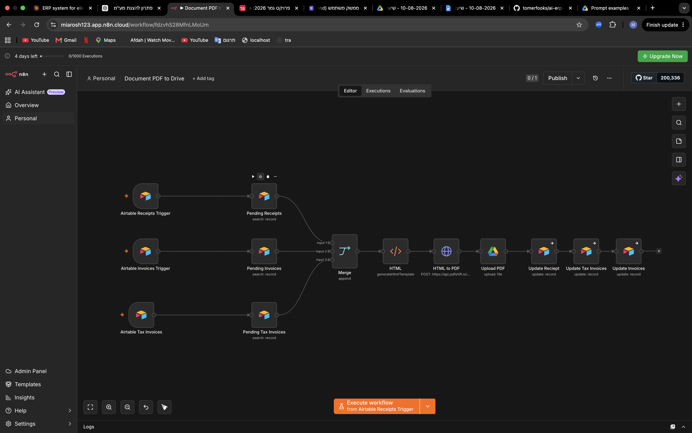
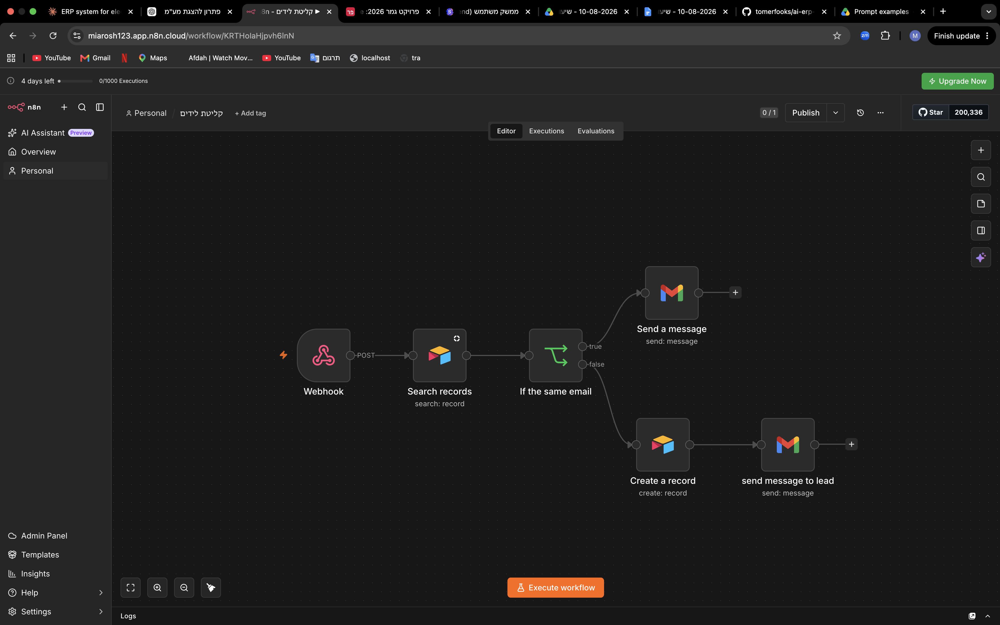
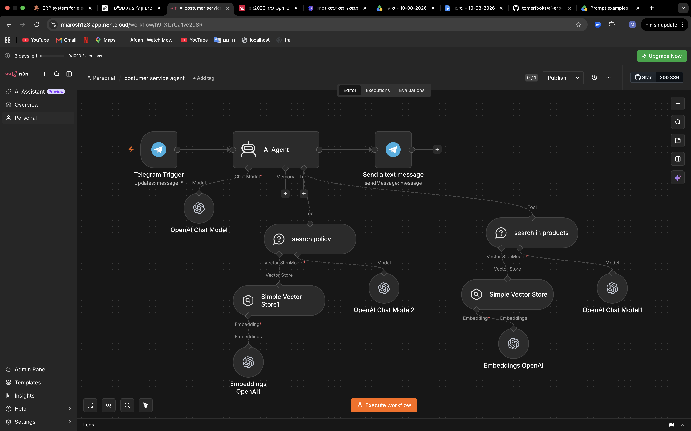
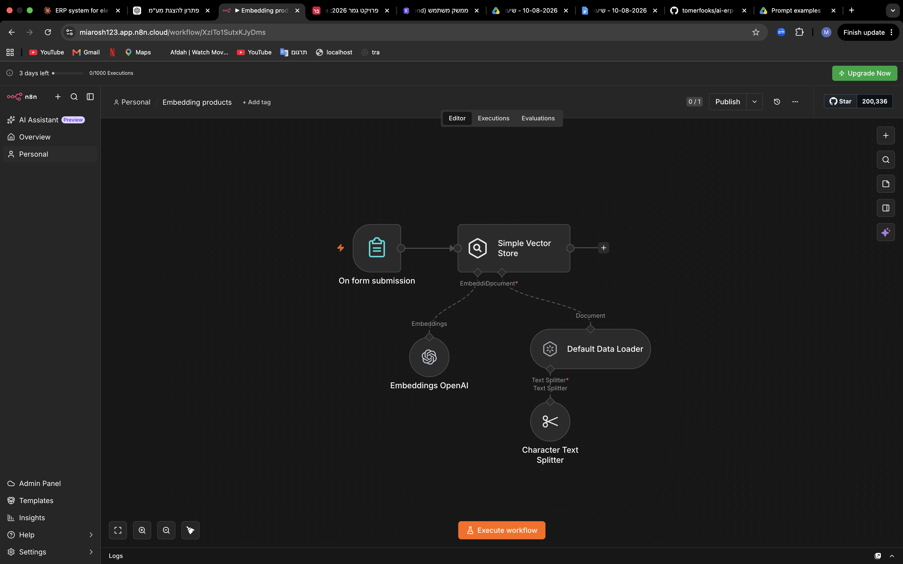
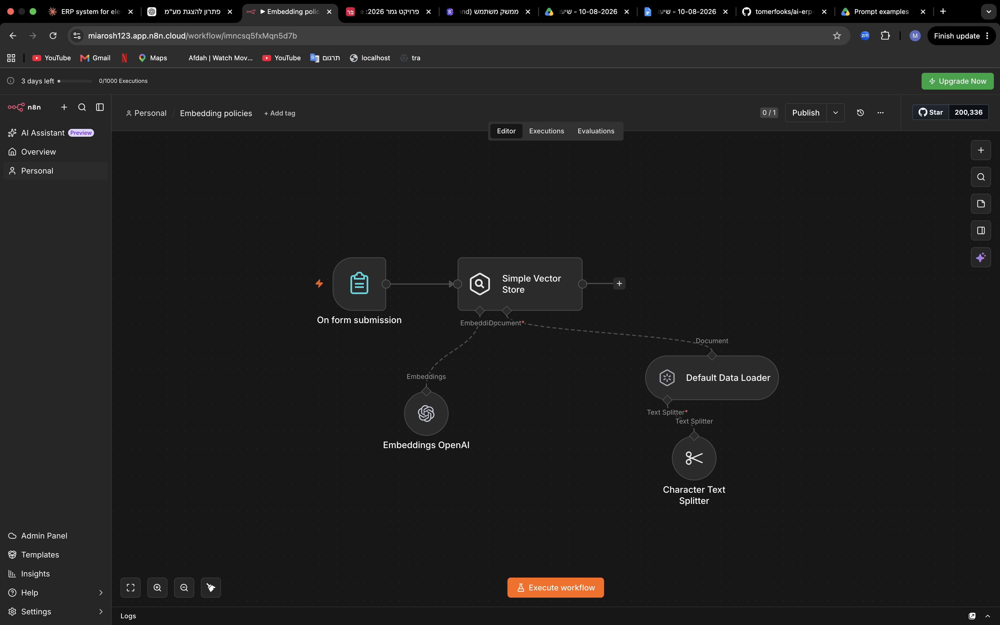
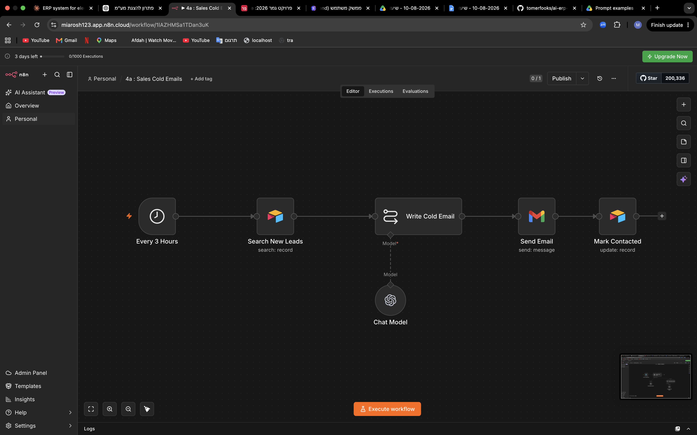

#  Volt Electronics — AI-Powered ERP

A working mini-ERP for a fictional Israeli electronics business, automated end to end with **n8n Cloud**, **3 AI agents**, **RAG** and a **custom dashboard**. No servers, no Docker — the whole system is n8n Cloud + Airtable + a single HTML file.

---

### How it works

```
  Telegram (manager)  ──┐                    ┌──▶ Airtable       (8 tables)
  Telegram (support)  ──┤                    ├──▶ Gmail          (sales outreach)
  Gmail inbox         ──┼──▶  n8n Cloud  ────┼──▶ Google Drive   (PDF documents)
  Web form / webhook  ──┤    agents + RAG    ├──▶ Telegram       (replies)
  Dashboard           ──┘                    └──▶ PDFShift       (HTML → PDF)
```

Airtable is the single source of truth (8 tables, Israeli tax-compliant). Documents render to PDF and land in Google Drive. The dashboard is a standalone HTML file. Embeddings are multilingual so Hebrew works out of the box.

### The automations

| # | Workflow | Trigger | Demonstrates |
|---|----------|---------|--------------|
| 1 | Tax-Doc Validation | new Invoice / TaxInvoice / Receipt | Israeli VAT rules (18%, 17% before 2025), sequential doc numbers; valid → file queue, invalid → flagged |
| 2 | Contact Intake | new Lead | Normalisation + de-duplication by email |
| 3 | Sales Cold Emails | every 3h | LLM writes a personalised email, Gmail sends it, lead marked contacted |
| 4 | Customer Service Agent | Telegram | RAG agent — policies + products as retrieval tools, Hebrew and English |
| 5 | Policies Embedding | manual | Documents → chunks → embeddings → vector store |
| 6 | Products Embedding | manual | Same pipeline over the live catalogue |
| 7 | Document Pipeline | every minute | Queue → RTL HTML → PDF → **Google Drive** |
| 8 | Manager Agent | Telegram | Tool calling (`search_invoices`, `search_tasks`, `create_task`), owner-only |

### The AI side

- **Manager agent** — Tools Agent, calls `search_invoices` across 3 tables, `create_task`. Owner verified by Chat ID before agent runs.
- **Customer service agent** — pure RAG with two separate stores (`policies`, `products`). Cannot invent answers.
- **Sales agent** — LLM Chain drafts cold emails; a second workflow watches the inbox and replies.

### Screenshots















### Stack

`n8n Cloud` · `AI agents & tool calling` · `RAG / vector store` · `Airtable` · `Telegram Bot API` · `Gmail + Drive APIs` · `OAuth 2.0` · `Chart.js` · `PDFShift`

### Known limits

Vector store is in-memory (wiped on restart). Airtable polls at ≥1 min off `Created time`. Sequential numbering can race. Relationships are string IDs, not links. Dashboard is single-user. Google OAuth testing mode — token expires after 7 days.

---

<div align="center">

**Built with ⚡ by Mia Rosh** · 2026

</div>
